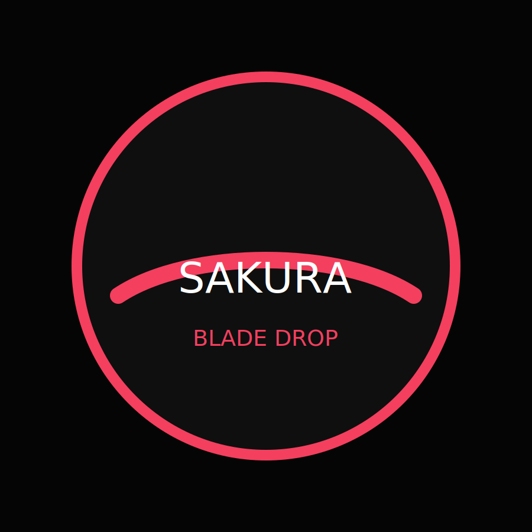

<div align="center">
    
    <h1>Tomoe Gozen — Oversize T-Shirt Store</h1>
    <p>Laravel 12 monolith • Blade + Alpine • GSAP + Lottie • MySQL</p>
</div>

## ✨ Highlights

- Mobile-first storefront for Japanese streetwear (catalog, detail, cart, checkout mock, collections, search/filter/sort)
- Admin panel (basic-auth protected) + REST API (Sanctum, admin & customer roles) with CSV import/export
- 30 seeded products, 10 sample orders, 1 admin (`admin@example.com / Admin123!`) & 1 customer (`user@example.com / User123!`)
- GSAP interactions, custom Lottie micro-animation, dark UI palette (black background, red accents, white typography)
- MySQL database + server-side cart persistence (user or session)

## 🚀 Installation

```bash
git clone <repo> tomoegozen
cd tomoegozen
cp .env.example .env   # or copy to suit your secrets
# fill in MySQL DB vars (see below)
composer install
npm install
npm run build   # or npm run dev for Vite
php artisan key:generate
php artisan migrate --seed
php artisan storage:link
php artisan serve    # http://127.0.0.1:8000
npm run dev          # for Vite HMR (optional)
```

To reseed only the shop data run:

```bash
php artisan db:seed --class=ShopSeeder
```

## 🗃️ Environment Variables

Use `.env.example` as reference:

```
DB_CONNECTION=mysql
DB_HOST=127.0.0.1
DB_PORT=3306
DB_DATABASE=tomoegozen
DB_USERNAME=root
DB_PASSWORD=
FILESYSTEM_DISK=public
SANCTUM_STATEFUL_DOMAINS=localhost,localhost:5173
```

## 🧱 Architecture

- **Backend:** Laravel 12, Sanctum auth, custom `role` middleware, API-first controllers (`app/Http/Controllers/Api/*`)
- **Frontend:** Blade views + Alpine-ready markup, GSAP animations (`resources/js/app.js`), custom CSS (`resources/css/app.css`)
- **Data:** Eloquent models for products, categories, collections, carts, orders. Seeder (`php artisan db:seed --class=ShopSeeder`) builds 30 products + orders.
- **Storage:** Product images stored locally (`public/images/products/*.svg`). Uploads saved to `storage/app/public/products` via admin API.

## 🛒 API Overview

| Method | Endpoint | Description |
| --- | --- | --- |
| `POST` | `/api/auth/register` | Customer registration |
| `POST` | `/api/auth/login` | Login => Sanctum token (ability = role) |
| `GET` | `/api/products` | Paginated list (search, `category`, `color`, `size`, `price_min`, `price_max`, `sort`) |
| `GET` | `/api/products/{slug}` | Product detail |
| `POST` | `/api/cart` | Add/update item (session/user carts) |
| `GET` | `/api/cart` | Retrieve cart (use `session_id`) |
| `DELETE` | `/api/cart/items/{id}` | Remove item (match user/session) |
| `POST` | `/api/checkout` | Mock checkout → creates order |
| `GET` | `/api/admin/orders` | Admin-only orders list |
| `POST` | `/api/admin/products` | Admin create product (multipart upload) |
| `POST` | `/api/admin/products/import` | CSV import (admin) |
| `GET` | `/api/admin/products/export` | CSV export |

All admin endpoints require `Authorization: Bearer <token>` from an admin login (or Basic Auth for Blade admin pages).

## 🗂️ Sample Product JSON

```json
{
  "sku": "TGZ-001",
  "name": "Tomoe Oversize Tee — Sakura Blade",
  "slug": "tomoe-oversize-tee-sakura-blade",
  "description": "Oversize cotton tee with Japanese sakura & blade print. Relaxed fit, pre-shrunk.",
  "price": 299000,
  "sale_price": 249000,
  "currency": "IDR",
  "colors": ["black", "red"],
  "sizes": ["M", "L", "XL", "XXL"],
  "stock_by_size": {"M": 12, "L": 10, "XL": 8, "XXL": 6},
  "category_id": 1,
  "tags": ["sakura", "japan", "oversize"],
  "image_url": "/images/products/tg01.svg",
  "is_featured": true
}
```

## 📦 npm Scripts

| Script | Description |
| --- | --- |
| `npm run dev` | Vite dev server |
| `npm run build` | Production build (GSAP & Lottie bundled) |
| `npm run preview` | Preview production build |
| `npm run assets:analyze` | Vite build with bundle analysis |

Dependencies: `alpinejs`, `axios`, `gsap`, `lottie-web`.

## 📊 Admin Panel

- `GET /admin` — dashboard with sales/Orders summary (protected with HTTP Basic Auth; credentials from seeders)
- `GET /admin/products` — paginated list, CSV import/export helpers
- `GET /admin/orders` — concise order table

## 🧪 Testing

Run PHPUnit (requires configured DB):

```bash
php artisan test
```

## 🛠️ Deployment Notes

1. Provision PHP 8.2+, Composer, Node 18+, MySQL and configure env vars
2. Run `php artisan migrate --seed` (preferrably via CI/CD task)
3. Upload `storage` symlink (`php artisan storage:link`)
4. For Render / DigitalOcean App Platform:
   - Web service command: `php artisan serve --host=0.0.0.0 --port $PORT`
   - Background worker (optional) for queues: `php artisan queue:work`
   - Provide MySQL + Sanctum env vars in dashboard
5. Invalidate caches after each deploy (`php artisan config:clear && php artisan route:clear`)

### Headless Option

If you prefer a separate SPA (Next.js/Nuxt/etc.), treat `/api/*` endpoints as headless backend. Auth via Sanctum tokens; ensure your frontend domain is added to `SANCTUM_STATEFUL_DOMAINS`.

---

Made with ❤️ for oversize tee drops.
